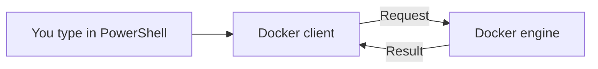
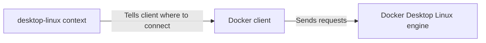

# Docker client and engine

## Goal

Explain what the client does, what the engine does, and how Docker chooses an engine.

## The main idea

Docker has two main parts you need to understand first:

- **Client:** the tool that accepts your Docker commands and sends requests to the engine.
- **Engine:** the software that does the work, such as creating and running containers. For now, think of a container as a separate environment for an app's process. We will study containers in the next phase.

PowerShell is your shell: the place where you type commands. When you type a Docker command there, PowerShell starts the Docker client.



The client asks for work. The engine does the work and sends back a result.

## A small example

`docker ps` asks the engine to list running containers. The client sends that request and shows the result. This is an example to read; we have not run it yet.

The client can be installed even when the engine is stopped. In that case, the client may start, but it cannot get the container list from the engine.

## Which engine?

A **Docker context** is a saved connection setting. It tells the client which engine to contact. That engine can be on your computer or another computer. We will check the selected context before running exercises.

## Session status

Guided command checks are complete for client, context and engine connection. Your latest output confirms a reachable Linux engine. Independent understanding and the remaining Lab 00 checks are pending. Earlier failures are recorded below as history.

## Your PowerShell result

You ran the two suggested commands. Your selected context is `desktop-linux`, and your client version is `28.0.4` on Windows. The engine connection failed: Windows could not find the `dockerDesktopLinuxEngine` pipe. A pipe is a local connection that programs use to communicate.

This shows that the client works but cannot reach the selected engine. It does not tell us the exact cause. Docker Desktop may be closed, still starting, or unable to start its Linux engine.

The suggested next step at that time was to open Docker Desktop from the Windows Start menu and wait for its engine to finish starting. Then run `docker version` again. A successful check should include both Client and Server sections. If Desktop shows an error or stays on its starting screen, share that message before changing settings.

Reference: [Docker's Windows startup instructions](https://docs.docker.com/desktop/setup/install/windows-install/).

Your next output included both Client and Server sections:

| Item | Observed result |
|---|---|
| Selected context | desktop-linux |
| Client | 28.0.4, windows/amd64 |
| Docker Desktop | 4.40.0 (187762) |
| Engine | 28.0.4, linux/amd64 |

The connection now works. The Windows client is talking to a Linux engine managed by Docker Desktop. This does not mean Windows changed into Linux. The precise cause of the earlier failure was not confirmed by the learner.

This is guided practice, not yet an independent understanding check. No container run has been shown. Next: answer a fresh client/engine question, then finish the remaining setup checks.

## Is Docker Desktop the client?

Docker Desktop is a package that includes the Docker client, the engine, and other tools. It also provides the app window used to manage Docker.

| Name | Meaning |
|---|---|
| Docker Desktop | The installed package and app that brings the tools together |
| Docker client (CLI) | The `docker` command you use in PowerShell; CLI means command-line interface |
| Docker engine | The background software that runs and manages containers |

For example, when you type `docker ps`, you use the client included with Docker Desktop. The client asks the engine for a list of running containers.

This explains why the client could print its version earlier while the engine connection failed: they are separate parts of the same installation.

Source: [Docker overview](https://docs.docker.com/get-started/docker-overview/).

This was a clarification question, not an assessment answer. The assessment is paused; progress stays at Practiced.

## Client, engine and context in your setup

The Docker term here is **engine**, not agent.

Docker Desktop includes both the client and the engine. The context is a saved connection setting used by the client. It is not another running program. Your selected context is `desktop-linux`, which points to Docker Desktop's Linux engine.



This describes the connection we checked. Docker can have several saved contexts, and the client can connect to other engines. You do not need extra engines for this lesson.

Your latest output confirms that this connection works. The previous connection error is historical, not the current state.

This explanation clarifies the learner's terminology. It does not count as a completed assessment.

## Context question: result

Scenario: the selected context points to another computer that is offline, while the local engine is running. The learner selected B: the client cannot reach the selected engine.

The coach confirmed B and repeated that the context selects the engine before asking for a reason. The learner then explained: "because the context tells the client to send the request to another engine in another computer".

This is correct reasoning. The local engine does not help because the client is sending its request elsewhere. The choice was made without a hint; the explanation followed confirming feedback. Record this as a successful check with that help noted, not a full independent phase assessment.

Next: check `docker info` and `docker compose version` in the learner's terminal. Keep the setup outcome open until the remaining checks, a container run and the learner's explanation are complete. Review context selection again in a fresh case next session.

## Docker info and Compose: successful checks

The learner supplied actual output from both commands. Server Version is `28.0.4`, Operating System is `Docker Desktop`, OSType is `linux`, and Compose is `v2.34.0-desktop.1`. These checks confirm a reachable Linux engine and an available Compose command.

The output also showed 26 existing containers, including 6 running containers. These are existing workloads, not evidence of a course exercise. No course container run has been shown yet. Output included resource-control and security-setting warnings; their causes were not investigated or changed in this session.

Next: explain the hello-world image download and temporary container before the learner runs the Lab 00 example. The command list is saved in [Commands we learn](../ROADMAP.md#commands-we-learn).

## Lab 00: first container exercise

Date: 1405-06-22 (Jalali), Asia/Tehran. Continuing Lab 00, which started on time today. Due date: 1405-06-26. No section is overdue. This small step should take about 5–10 minutes, excluding any download delay.

Goal: ask the engine to run a small test program and inspect the result.

An image is a package with the files needed to run a program. A container is a separate environment created from that image to run the program. We will study this difference more in Phase 1.

Run in PowerShell:

```powershell
docker run --rm hello-world
```

| Part | Meaning |
|---|---|
| `docker` | Uses the Docker client. |
| `run` | Asks the engine to create and start a new container. |
| `--rm` | Removes that container after it exits. The image stays. |
| `hello-world` | Names the image with the small test program. |

If the image is missing locally, Docker downloads it from Docker Hub, an online image library. The program should print a greeting and exit. This command removes only its own temporary container. It does not remove existing containers.

Before running, predict what `--rm` removes: the container, the image, or both. Then share the actual output. The predicted greeting is not yet observed evidence. If a download or engine error occurs, record it and diagnose it before marking the run complete.

## Lab 00 result: image download failed

The learner ran `docker run --rm hello-world`. The engine reported that the image was missing locally, then returned `EOF` while contacting `https://registry-1.docker.io/v2/`.

The client reached the engine. The next connection, from Docker to the online image registry, failed. EOF means the response ended before Docker could complete it. This output does not identify the exact cause. A temporary connection problem, proxy or VPN issue, or a registry-side problem are possible causes. No successful test-container run was observed.

Next: retry the same command once. If it fails again, establish whether the learner uses a VPN or proxy and inspect Docker Desktop proxy settings before changing them. Docker Desktop can use system or manual proxy settings: [Docker networking guidance](https://docs.docker.com/desktop/features/networking/). Existing workloads must be preserved during troubleshooting.

Timing: this attempt is still within the Lab 00 target of 1405-06-26. A download failure does not show a misunderstanding. The learner's prediction about `--rm` remains unanswered.

## Lab 00 retry: successful container run

Date: 1405-06-22 (Jalali), Asia/Tehran.

The learner retried `docker run --rm hello-world` and supplied successful output. Docker downloaded the missing image and the container printed `Hello from Docker!`.

Observed image digest: `sha256:5e23090353324d887c48ad5e5c56d294eab81588df9605b07d1afe895f9cc8f8`.

The successful retry confirms an image download and a working container run. The cause of the earlier EOF is still unknown; no further network troubleshooting is needed now. The daemon mentioned in the output is the background service that we have been calling the engine.

Assistance: the coach provided the command and explained each part. Evidence level for the lab remains Practiced until the learner explains the result independently. The command requests removal of its temporary container after exit; removal has not been checked separately. The image is expected to remain. The Ubuntu command printed by hello-world is an optional upstream example, not a command introduced in this course.

Timing: successful run on 1405-06-22, four calendar days before the Lab 00 due date of 1405-06-26. This is early runtime evidence, not a completed Lab 00 outcome. The lab finish date remains blank pending the learner explanation.

Next: learner explains what `--rm` removes, what remains, and whether repeating the command with the image still present needs a download. Keep the final Phase 0 review separate.

## Correction: image and container removal

The learner answered that `--rm` removes the image. This needs correction. They correctly said that another run can use the local image without downloading it again.

An image is the stored package of program files. Each run creates a new container from that image. With `--rm`, Docker removes that container after it exits; the image stays available for another run.

```text
Stored image → Container A → exits → A is removed
Same image   → Container B → exits → B is removed
```

This is the first recorded error on this distinction. Pause completion and teach it before another check. Fresh check: imagine running the command twice successfully; explain whether the second run reuses the first container or creates a new one, and where its program files come from. No new command is needed.

Evidence: correct local-image reuse; image/container removal confused. Lab 00 remains Practiced with no finish date. Timing remains within the 1405-06-26 target.

In the two-run check, the learner said the second run uses the first container, but correctly said its files come from the image. The coach explained that the removed container cannot be reused and showed separate containers A and B. A recipe/meal analogy supported the explanation: the same recipe can produce a new meal.

After this help, the learner correctly answered that container A does not exist after the first run finishes with `--rm`. This is a correct guided answer, not yet independent proof that the full distinction is clear. Two earlier errors are recorded; do not count the current correct answer as another failed attempt.

Next: ask for one short explanation of what happens when the command runs again, without providing the answer first. If the distinction remains unclear, use observed container/image inspection rather than repeating the quiz. Lab 00 remains Practiced.

## Successful check after correction

The learner explained: "it creates a new container, it uses image to create it". This correctly connects the new container with the saved image. The earlier removal and reuse confusion was corrected with teaching and follow-up questions. Stop the correction loop now.

Evidence stays Practiced because this answer followed guided correction. Recheck the distinction in a fresh case next session. Next learning step: shell and setup readiness, then the Phase 0 review. Keep Lab 00's finish date blank until the remaining independent explanation is complete.

## Summary

- `--rm` removes the container after exit; the image stays.
- Docker Desktop includes the client, engine and other tools.
- The client sends requests.
- The engine runs and manages containers.
- The context selects the engine to contact.
- Having the client installed does not prove the engine is running or reachable.
