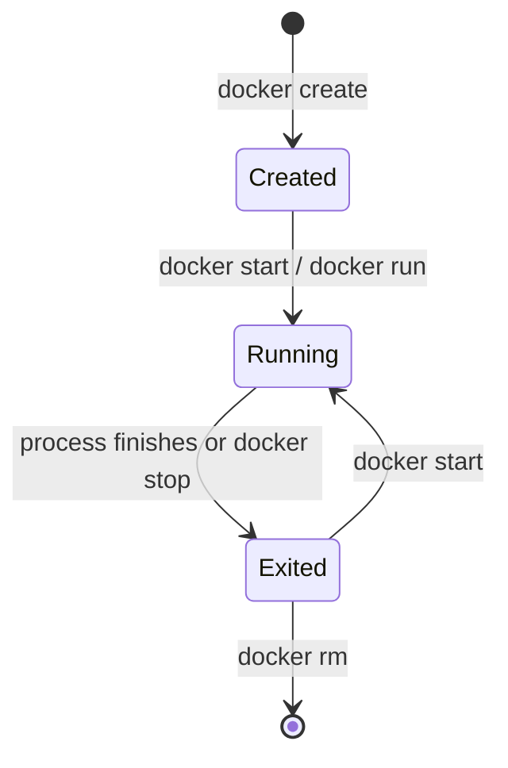

# The Container Lifecycle

## Previous-note recap

Image: reusable template; container: runnable instance; Engine: lifecycle manager.

## Visual model



A container normally exists as long as its main process exists. `docker stop` asks that process to stop; `docker rm` removes the stopped container. `docker run` creates a new container unless an existing one is explicitly started.

## Small lab

```powershell
docker run -d --name dlc-session-02 nginx:alpine
docker ps --filter name=dlc-session-02
docker stop dlc-session-02
docker ps -a --filter name=dlc-session-02
docker start dlc-session-02
docker rm -f dlc-session-02
```

Before each command, predict the lifecycle state and verify it with `docker ps`.

## Summary

Containers are stateful lifecycle objects, but their lifetime is tied to the main process. Start, stop, and remove are different operations.
