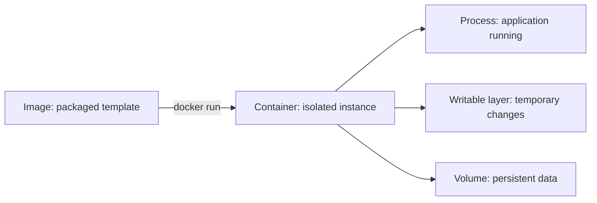

# Phase 1: Container Mental Models

## Goal

Build a reliable visual model of what Docker creates, runs, changes, and preserves.

## Sequence

1. [Image, container, and engine](image-container-model.md)
2. [The container lifecycle](docker-run-lifecycle.md)
3. [Writable layers and volumes](filesystem-and-volumes.md)

## Phase visual map

Each daily session should cover one node or relationship, one prediction, and one observable lab result.
