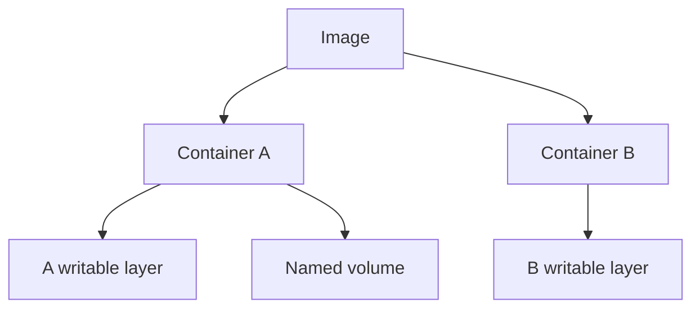
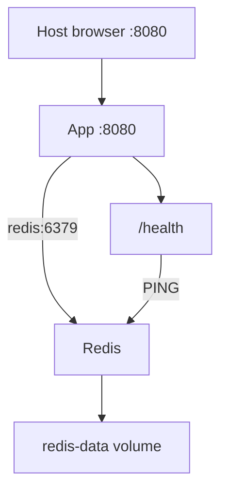
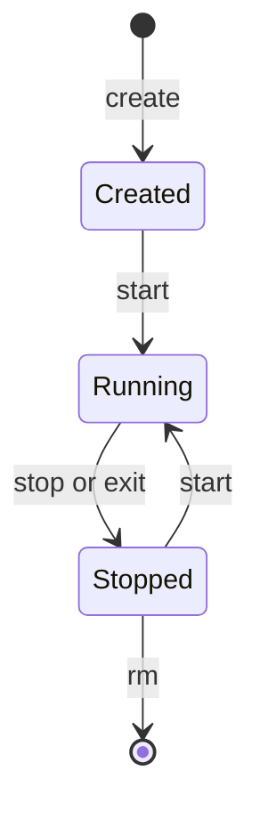

# Visual teaching

Use visuals to explain relationships, then connect them to observed lab output. Prefer short labels and no more than five nodes across. Never represent predicted output as observed evidence. Adapt to the current topic rather than displaying every diagram.

## Image, container and data

Removing A removes its writable layer; the named volume can be mounted into a replacement. Ask what happens to B and the volume when A is removed. Use the actual lab names in a learner note.

## Compose topology

The host port reaches the app; the app reaches Redis by its service name within the Compose network. Ask which edge fails if REDIS_HOST becomes localhost. State that loopback binding restricts the host listener; it does not change the app's container listening interface.

## Lifecycle

Explain that run combines creation and start. Ask the learner where an exited hello-world container would appear without --rm.

## Exact comparisons

| Operation | Existing container | Image | Named volume |
|---|---|---|---|
| stop | Preserved, stopped | Preserved | Preserved |
| start | Same container runs | Preserved | Reattached as configured |
| rm | Removed | Preserved | Preserved by ordinary rm |
| build | Unchanged | New result/tag may be produced | Unchanged |

When explaining cache, draw only the active Dockerfile steps and highlight the first changed input. For networking, label host and container ports separately. For an interactive what-if exercise, let the learner alter one port, hostname or mount and predict the result. Always include a short textual explanation so learning does not depend on a particular renderer.
